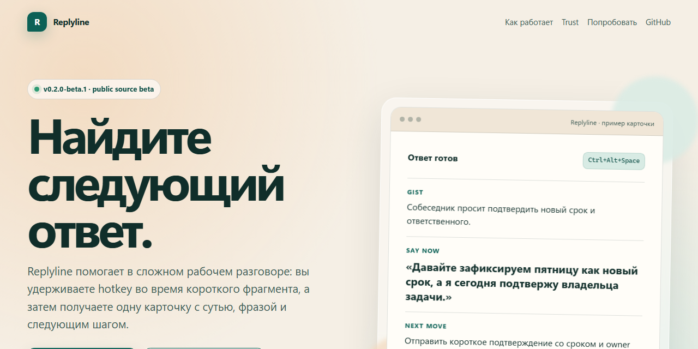

# Replyline

[](https://github.com/iurii-izman/replyline/actions/workflows/ci.yml)
[](https://iurii-izman.github.io/replyline/)
[](https://github.com/iurii-izman/replyline/releases)
[](LICENSE)
[](docs/product/limitations.md)

Windows-first desktop tray app — universal live assistant for work conversations.

Core flow: `capture -> stt -> llm -> card`



## Public Beta

The current public entry is a Windows **source/developer beta** for testers and contributors:

- [Open the product page](https://iurii-izman.github.io/replyline/)
- [Run the 15-minute beta test](BETA_TESTING.md)
- [Read the user guide](docs/product/user-guide.md)
- [Read privacy and data-flow boundaries](docs/product/privacy.md)
- [Read current beta limitations](docs/product/limitations.md)
- [Read the beta release notes](https://github.com/iurii-izman/replyline/releases/tag/v0.2.0-beta.3)
- [Ask a question or share feedback](https://github.com/iurii-izman/replyline/discussions)
- [See the public roadmap](docs/roadmap.md#public-roadmap)

No unsigned artifact is presented as a public installer. Until an Authenticode-signed build
is verified and published, use the source setup below.

## What It Does

- Hotkey-gated capture (`Ctrl+Alt+Space`) of short system-audio snippets.
- WorkConversation returns one compact response card: `gist / say_now / next_move` (generated from `CardSchemaV3`). An active ContextPack can be attached to provide background and role context.
- Interview Mode is a context usage example: WorkConversation + an interview-oriented context + `InterviewCardSchemaV1` + local post-interview report.
- Scope stays intentionally narrow for stable-beta reliability and trust.

If the LLM returns a vague `next_move`, Rust repairs it with bounded context heuristics before rendering.

## What It Is Not

Replyline is not a meeting assistant, not a transcript tool, and not a speaking coach.

Not in the current beta:

- no transcript/history/team workflow UI
- no hidden cheating workflow
- no click-through hidden overlay
- no Advanced Mode user surface
- no memory user surface
- no bilingual/live-translation interview surface in the current public beta

## Engineering highlights

Built for correctness and trust, not hype:

- **Tauri v2 + Rust backend** — WASAPI loopback capture, typed IPC contract (40 commands, 9 categories), settings migration chain v1→v10, corrupt-file quarantine.
- **Solid.js + TypeScript frontend** — Controller pattern with 10 domain modules, deterministic error mapping, mock platform for UI tests (189 tests).
- **Deepgram STT + OpenAI-compatible LLM route** — User-configured providers, RAM-only transcripts, redacted export as default sharing path.
- **Privacy-first local storage** — API keys in Windows Credential Manager, settings in local JSON, no background recording, no transcript history DB.
- **Quality gates** — `pnpm verify` (blocking CI), `pnpm verify:full` (release), advisory release-freeze guard, 454 automated tests (265 Rust + 189 TS), security lane checks, public footprint guard, secret leak scanner.
- **Release discipline** — Honest beta posture (unsigned artifacts stay internal), Authenticode-gated public binary, release artifact manifest with checksum plan, changelog, release notes, operator evidence bundle.

## Supported Runtime Path

- OS: Windows 10/11
- Capture: WASAPI loopback, hold-to-capture
- STT: Deepgram
- LLM: OpenAI-compatible endpoint (user-configured)
- Stack: Tauri (Rust) + Solid.js (TypeScript)

## Quick Start

```bash
git clone https://github.com/iurii-izman/replyline.git
cd replyline
pnpm install --frozen-lockfile
pnpm beta:doctor   # checks: Node.js, pnpm, Rust, Tauri, WebView2
pnpm beta:start    # prints readiness summary, then launches app
```

`pnpm beta:start` verifies your environment and launches the app via `pnpm tauri dev`.
No pre-installed provider keys required — the app starts in setup mode and guides you
through configuration.

Then configure in the app UI:
1. **Speech** — Deepgram API key
2. **LLM** — OpenAI-compatible URL + model (e.g., `https://api.openai.com/v1`, `gpt-4o-mini`)
3. **Hotkey** — default `Ctrl+Alt+Space`

See the [user guide](docs/product/user-guide.md) for detailed setup instructions.

**This is a source/developer beta.** No unsigned artifact is presented as a public
installer. Use `git clone` + `pnpm beta:start` until a signed installer is available.
See [beta limitations](docs/product/limitations.md) for current scope.

## Documentation Map

- [BETA_TESTING.md](BETA_TESTING.md) - short beta smoke path for Windows testers (includes ContextPack smoke path).
- [docs/product/user-guide.md](docs/product/user-guide.md) - setup, settings, first-10-minutes onboarding, flows, exports, and troubleshooting.
- [docs/product/screenshots.md](docs/product/screenshots.md) - screenshot checklist, redaction rules, and public-safe slots.
- [docs/product/privacy.md](docs/product/privacy.md) - capture, storage, providers, and sharing boundaries.
- [docs/product/limitations.md](docs/product/limitations.md) - current beta scope and non-shipped tracks.
- [CONTRIBUTING.md](CONTRIBUTING.md) - contributor workflow and required validation.
- [docs/engineering/testing.md](docs/engineering/testing.md) - canonical testing guide: public profiles, internal building blocks, targeted lanes, fixture boundaries, CI alignment, and lifecycle policy.
- [docs/README.md](docs/README.md) - short role-based map for product, contributor, and operator paths.
- [docs/roadmap.md](docs/roadmap.md#public-roadmap) - public roadmap: now, next, later, not planned.

## Security and Support

- Security reporting: [.github/SECURITY.md](.github/SECURITY.md)
- Support and issue routing: [.github/SUPPORT.md](.github/SUPPORT.md)

## License

[MIT](LICENSE)

## Releases

- Stable tag format: `vX.Y.Z`; prerelease format: `vX.Y.Z-beta.N`.
- On push of a `v*` tag, GitHub Action `Release On Tag` creates release notes and validates a Windows artifact package.
- Notes are grouped by labels via `.github/release.yml`.
- Artifact naming is signing-aware:
  - unsigned packages remain internal workflow artifacts
  - `Replyline-vX.Y.Z-windows-signed.zip` is attached only after Authenticode validation succeeds
- Source archives remain available on every GitHub Release.
