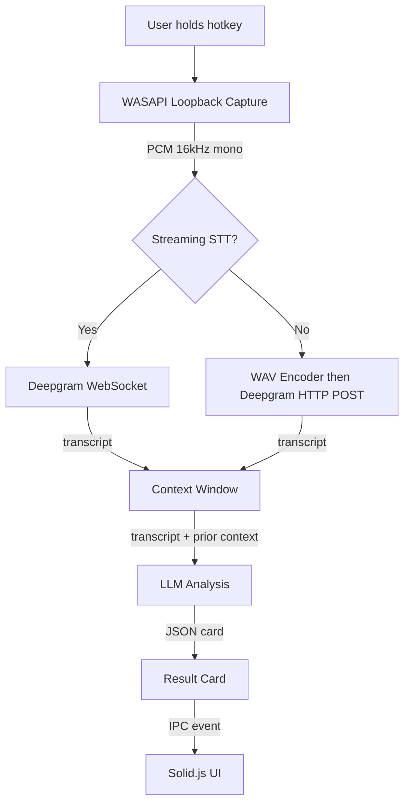

# Replyline Architecture Overview

This document describes the internal architecture of Replyline as of the v0.1.0 alpha baseline.

## High-Level Data Flow



When `useStreamingStt` is enabled, PCM samples are piped directly over a Deepgram WebSocket during capture (no WAV step). Otherwise the default batch HTTP POST path is used.

### ASCII Reference

```
User holds hotkey
       |
       v
+------------------+
|  WASAPI Loopback  |  (system audio capture, not microphone)
+------------------+
       |  PCM samples (f32, 16kHz mono)
       v
+------------------+
|   WAV Encoder     |  encode_wav() -- in-memory RIFF/WAV
+------------------+
       |  WAV bytes
       v
+------------------+
|  Deepgram STT     |  HTTP POST to Deepgram Nova-3
+------------------+
       |  transcript text
       v
+------------------+
|  Context Window   |  RAM-only, 20-min TTL, max 3 entries
+------------------+
       |  transcript + prior context
       v
+------------------+
| LLM Analysis      |  OpenAI-compatible chat completion
+------------------+
       |  structured JSON
       v
+------------------+
|  Result Card      |  { gist, say_now, next_move }
+------------------+
       |  IPC event
       v
+------------------+
|  Solid.js UI      |  overlay window renders card
+------------------+
```

User releases hotkey to trigger the capture-stop-and-analyze pipeline.
The entire flow runs on each hotkey release cycle.

## Component Layers

### UI Layer (Solid.js + TypeScript)

```
src/
  App.tsx              Root component, wires surfaces
  App.css              Global styles and token structure
  app/
    ChromeSurface.tsx   Shell chrome: header, status, messages, footer
    MainSurface.tsx     Result card display (gist / say_now / next_move)
    SettingsSurface.tsx  Provider config, NotebookLM launch URL, hotkey, language, secrets
    controller.ts       Reactive state machine (Solid.js signals + store)
    model.ts            Type definitions: Phase, Panel, AppSettings, DTOs
    platform.ts         Tauri bridge abstraction (invoke, listen, shortcuts, clipboard)
```

The controller manages the app lifecycle through phases:
`booting -> idle -> capturing -> transcribing -> analyzing -> ready -> idle`

Error recovery returns to `error` phase with a user-safe message.

### IPC Bridge (Tauri Commands)

20 registered commands between frontend and backend:

| Command | Purpose |
|---------|---------|
| `load_bootstrap` | Initial state: settings, key presence, context status, log status |
| `save_settings` | Persist AppSettings to JSON |
| `acknowledge_tray_intro` | Mark tray intro as seen |
| `save_secret` | Store API key in Credential Manager |
| `delete_secret` | Remove API key from Credential Manager |
| `clear_context` | Reset conversation context |
| `get_context_status` | Query context entry count and active flag |
| `capture_start` | Begin WASAPI loopback recording |
| `capture_stop_and_analyze` | Stop capture, run STT + LLM pipeline, return card |
| `retry_last_analysis` | Re-run LLM on last transcript without re-capturing |
| `sync_tray_ui_phase` | Update tray tooltip from UI phase |
| `tray_open_main` | Show/focus the main window |
| `memory_list_spaces` | List all memory spaces |
| `memory_get_space_record` | Load a full space record (facts, commitments, terms) |
| `memory_save_space_record` | Persist a space record to disk |
| `collect_diagnostic_bundle` | Gather runtime evidence into a bundle |
| `get_log_status` | Return log path, last line, last debug WAV path |
| `log_client_event` | Append a frontend event to the app log |
| `open_notebooklm` | Open the configured NotebookLM URL in the system browser |
| `check_provider_health` | Ping Deepgram + LLM endpoints, return reachability status |
| `quit_app` | Exit the application |

Events emitted from backend to frontend:

| Event | Payload |
|-------|---------|
| `replyline://status` | `{ phase, detail }` -- pipeline progress |
| `replyline://open-settings` | `()` -- tray menu triggers settings panel |

### Backend Layer (Rust)

```
src-tauri/src/
  lib.rs               App setup: plugins, tray, menu, invoke handler
  commands.rs           Tauri command handlers, ReplylineState definition
  audio.rs              WASAPI loopback capture, WAV encoding
  deepgram.rs           Deepgram STT client (HTTP, retry/backoff)
  llm.rs                LLM analysis client (OpenAI-compatible, retry/backoff)
  providers/
    stt_provider.rs     STT provider facade used by pipeline orchestration
    llm_provider.rs     LLM provider facade used by pipeline orchestration
  context.rs            ConversationContext: RAM ring buffer with TTL
  settings.rs           Settings load/save (%APPDATA% JSON)
  credentials.rs        Windows Credential Manager (keyring) operations
  memory.rs             Memory layer: spaces, facts, commitments, terms (JSON store)
  app_log.rs            Append-only event log with 5MB rotation
  fs_atomic.rs          Atomic file write (write-tmp + rename)
  capture_debug.rs      Debug WAV persistence on STT failure
  diagnostic_bundle.rs  Runtime evidence bundle collection
  tray_status.rs        Tray tooltip text generation per phase
  types.rs              Shared types: AppSettings, DTOs, SecretSlot
```

### External Dependencies

| Service | Role | Protocol |
|---------|------|----------|
| Deepgram | Speech-to-text | HTTPS POST (WAV upload) |
| User-configured LLM | Transcript analysis | HTTPS POST (OpenAI chat completion format) |
| NotebookLM | External research/workspace tool | HTTPS URL opened in system browser |

Replyline does not bundle or host these services. The user configures endpoints, keys, and optional external tool URLs.

## State Management

```
ReplylineState (managed by Tauri)
  |
  +-- capture: Mutex<CaptureController>
  |     |
  |     +-- active: Option<CaptureRun>   (live WASAPI capture handle)
  |
  +-- context: Mutex<ConversationContext>
        |
        +-- entries: Vec<String>          (max 3, FIFO eviction)
        +-- last_touched: Option<Instant> (TTL anchor, 20 min)
        +-- last_transcript: Option<String>
        +-- last_card: Option<AnalysisCardDto>
```

Both mutexes are acquired per-command. The capture mutex is held briefly at start/stop boundaries.
The context mutex is held during formatting and push operations.

Context constraints:
- TTL: 20 minutes from last touch (auto-cleared on next access).
- Max entries: 3 transcript fragments.
- Max chars: 1500 total across all entries (oldest evicted first).

## File Storage Locations

### Roaming app data (`%APPDATA%\com.replyline.app\`)

| Path | Content | Format |
|------|---------|--------|
| `settings.json` | User preferences (hotkey, provider URLs, model, language) | Plaintext JSON |
| `memory/spaces.json` | Memory space index | JSON |
| `memory/<space-id>/record.json` | Per-space facts, commitments, terms | JSON |

### Local app data (`%LOCALAPPDATA%\com.replyline.app\`)

| Path | Content | Format |
|------|---------|--------|
| `app.log` | Append-only event log (5MB rotation) | Line-delimited text |
| `debug/` | Failed-STT WAV files (written only on STT errors) | WAV |

### Secrets

API keys are stored in Windows Credential Manager under the target prefix `com.replyline.app.credentials`. They never appear in `settings.json` or on disk as plaintext files.
