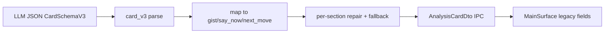

# Architecture

Replyline Slim Stable Beta architecture.

## Frontend

- `src/app/model.ts` — app state/types
- `src/app/platform.ts` — Tauri bridge
- `src/app/controller.ts` — runtime orchestration
- `src/app/MainSurface.tsx` — fixed status top + scrollable card body + fixed 3-action row
- `src/app/SettingsSurface.tsx` — minimal settings form

## Backend

- capture start/stop
- STT (Deepgram)
- LLM card build (`CardSchemaV3` in `src-tauri/src/card_v3.rs`, mapped to legacy DTO)
- Interview lane (`InterviewCardSchemaV1` during active interview session)
- local interview report store + explicit full/redacted markdown export commands
- context clear + retry

## Analysis card pipeline

- V3 contract: `question_brief`, `answer_now`, `star_evidence`, `next_step`, optional `risk_or_clarifier`.
- Legacy IPC/UI unchanged: `gist`, `sayNow`, `nextMove`.
- Quality flags (logs only): `repair_used`, `fallback_used`, `chars_band`.
- Migration: `docs/card-schema-v3-migration.md`.

## IPC contract (public path)

- `load_bootstrap`
- `save_settings`
- `save_secret`
- `delete_secret`
- `clear_context`
- `get_context_status`
- `capture_start`
- `capture_stop_and_analyze`
- `retry_last_analysis`
- `sync_tray_ui_phase`
- `refresh_tray_menu`
- `tray_open_main`
- `log_client_event`
- `quit_app`
