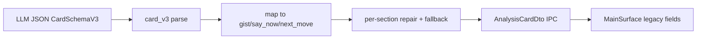

# Architecture

Architecture reference for the current Replyline beta.

## Frontend boundaries

Source-of-truth split (must stay stable):

- `src/app/model/settings.ts` — Phase, Panel, AppSettings, DEFAULT_SETTINGS, MainUiState
- `src/app/model/errors.ts` — CommandError parsing, user-safe error mapping
- `src/app/model/cards.ts` — Analysis card DTOs, interview card schema V1, asAnalysisCard
- `src/app/model/interview.ts` — Interview report/session DTOs
- `src/app/model/candidatePack.ts` — Candidate Pack DTOs and draft types
- `src/app/model/diagnostics.ts` — Bootstrap, setup status, persistence diagnostics DTOs
- `src/app/model/hotkeys.ts` — Hotkey normalization and KeyboardEvent parsing
- `src/app/model/routeMode.ts` — LLM route mode detection (local/cloud)
- `src/app/model/bilingualExperimental.ts` — Bilingual interview DTOs, state, gated by default
- `src/app/model/index.ts` — Barrel re-export, canonical import surface (`from "./model"`)
- `src/app/platform.ts` — Tauri/browser bridge (`invoke`, listeners, shortcuts, clipboard, window)
- `src/app/controller.ts` — re-export entry for controller layer (`controller/index.ts`)
- `src/app/controller/index.ts` — orchestration composition and app-level state wiring
- `src/app/controller/hotkeys.ts` — capture hotkey lifecycle and capture start/stop orchestration
- `src/app/controller/pipelineActions.ts` — retry/clear/copy actions
- `src/app/controller/settingsActions.ts` — bootstrap/setup/settings persistence flow
- `src/app/controller/lifecycle.ts` — runtime status listeners and run-id event acceptance rules
- `src/app/controller/traySync.ts` — tray phase synchronization side effect
- `src/app/controller/selectors.ts` — derived UI state/selectors for main surface
- `src/app/controller/keyboardShortcuts.ts` — non-hotkey keyboard actions in UI
- `src/app/controller/notices.ts` — ephemeral notice lifecycle/timers

UI surfaces remain view-focused and do not own orchestration:

- `src/app/MainSurface.tsx`
- `src/app/SettingsSurface.tsx`
- `src/app/CandidatePackStudio.tsx`

## Backend ownership map

- `src-tauri/src/commands/mod.rs` — IPC command boundary (registration surface in `src-tauri/src/lib.rs`)
- `src-tauri/src/settings.rs` — settings schema, migration chain, validation, corrupt-file quarantine
- `src-tauri/src/types.rs` — IPC DTOs and `CommandError` envelope
- `src-tauri/src/services/capture_pipeline.rs` — capture→STT→LLM orchestration
- `src-tauri/src/services/pipeline_errors.rs` — sanitized pipeline error logging + `CommandError::Pipeline`
- `src-tauri/src/card_v3.rs` — CardSchemaV3 parse/repair/mapping to legacy DTO fields
- `src-tauri/src/interview_card_v1.rs` — deterministic InterviewCardSchemaV1 contract

## Analysis card pipeline

- V3 contract: `question_brief`, `answer_now`, `star_evidence`, `next_step`, optional `risk_or_clarifier`.
- Legacy IPC/UI unchanged: `gist`, `sayNow`, `nextMove`.
- Quality flags (logs only): `repair_used`, `fallback_used`, `chars_band`.
- Migration notes: see git history for schema v3 migration context.

## IPC contract categories

Command grouping is enforced by `scripts/check-ipc-handler-contract.mjs`:

- `user`: bootstrap/context/core UI events
- `runtime`: capture + retry flow
- `settings`: save/settings/runtime preflight checks
- `secrets`: credential save/delete
- `candidate`: candidate pack read/write/prepare
- `report`: interview session/report/export commands
- `diagnostics`: persistence/trace diagnostics
- `trayWindow`: tray/menu/window sync commands
- `bilingual`: experimental bilingual interview commands (gated by `bilingualInterviewEnabled`, disabled by default)

## Experimental tracks

Features that exist in the codebase but are gated/disabled by default and not shipped in the current public beta.

### Bilingual Interview Mode

- **Status:** Experimental, disabled by default (`bilingualInterviewEnabled: false`, `liveTranslationEnabled: false`).
- **Scope:** Split pipeline for interview help — passive EN transcript streaming + RU translation + hotkey-triggered answer card generation.
- **Code:** `src-tauri/src/bilingual/` (Rust backend), `src/app/BilingualInterviewSurface.tsx` (frontend).
- **Commands:** `start_bilingual_session`, `stop_bilingual_session`, `capture_bilingual_answer`, `export_bilingual_interview_report` — registered but callable only when feature flag is enabled.
- **Docs:** `docs/archive/experimental/bilingual-implementation-status.md`.
- **Activation:** See activation checklist in the archive doc. Do not enable without completing manual QA on ≥2 Windows machines, sustained soak testing, and backend command guard.
