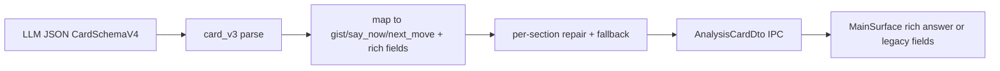

# Architecture

Architecture reference for the current Replyline beta.

## Core Product Boundary

Replyline's core product is intentionally narrow:
- **WorkConversation** — `gist / say_now / next_move` card from one capture
- **ContextPack** — single active conversation context primitive
- **One response card per capture** — no history, no feed, no continuous recording

Secondary features:
- **Interview Mode** — context usage example built on WorkConversation + interview ContextPack
- **Bilingual experimental** — frozen, gated behind env flag + setting, compiled but not active

All architecture decisions serve the core product first. Secondary features share the same pipeline and UI shell but are explicitly marked as non-core.

## Frontend boundaries

Source-of-truth split (must stay stable):

### Model layer (10 modules)

- `src/app/model/settings.ts` — Phase, Panel, AppSettings, DEFAULT_SETTINGS, MainUiState (64 loc)
- `src/app/model/errors.ts` — CommandError parsing, user-safe error mapping (120 loc)
- `src/app/model/cards.ts` — Analysis card DTOs, interview card schema V1 (100 loc)
- `src/app/model/interview.ts` — Interview report/session DTOs (36 loc)
- `src/app/model/diagnostics.ts` — Bootstrap, setup status, persistence diagnostics DTOs (92 loc)
- `src/app/model/hotkeys.ts` — Hotkey normalization and KeyboardEvent parsing (24 loc)
- `src/app/model/routeMode.ts` — LLM route mode detection (local/cloud) (23 loc)
- `src/app/model/contextPack.ts` — ContextPack DTOs and types (17 loc)
- `src/app/model/bilingualExperimental.ts` — Bilingual interview DTOs, state, gated by default (143 loc)
- `src/app/model/index.ts` — Barrel re-export, canonical import surface (76 loc)

Additional frontend modules:
- `src/app/modelPresets.ts` — Model preset definitions and resolution (5 presets, 4 OpenRouter)
- `src/app/answerProfiles.ts` — Answer profile/style definitions (work_default, work_concise, etc.)
- `src/app/platform.ts` — Tauri/browser bridge (`invoke`, listeners, shortcuts, clipboard, window)

### Controller layer (10 modules)

- `src/app/controller/index.ts` — Orchestration composition, app-level state wiring (726 loc)
- `src/app/controller/hotkeys.ts` — Capture hotkey lifecycle and capture start/stop orchestration (313 loc)
- `src/app/controller/settingsActions.ts` — Bootstrap/setup/settings persistence flow (248 loc)
- `src/app/controller/bilingualInterviewController.ts` — Bilingual interview orchestration (336 loc)
- `src/app/controller/selectors.ts` — Derived UI state/selectors for main surface (139 loc)
- `src/app/controller/pipelineActions.ts` — Retry/clear/copy actions (136 loc)
- `src/app/controller/lifecycle.ts` — Runtime status listeners and run-id event acceptance rules (114 loc)
- `src/app/controller/keyboardShortcuts.ts` — Non-hotkey keyboard actions in UI (75 loc)
- `src/app/controller/notices.ts` — Ephemeral notice lifecycle/timers (36 loc)
- `src/app/controller/traySync.ts` — Tray phase synchronization side effect (29 loc)

### UI surface layer

Main surface components (extracted to `src/app/main/`):

- `src/app/MainSurface.tsx` — Thin orchestrator, state routing to sub-components (347 loc)
- `src/app/main/SetupFocusState.tsx` — Setup wizard: 3-step checklist, progress, CTAs (120 loc)
- `src/app/main/IdleReadyState.tsx` — Idle screen: readiness, status rail, context value hint (70 loc)
- `src/app/main/ProcessingState.tsx` — Capturing/transcribing/analyzing phase cards (47 loc)
- `src/app/main/LiveAssistShell.tsx` — Answer card layout: cockpit grid, interview carousel (234 loc)
- `src/app/main/LiveAnswerCard.tsx` — Primary answer hero: rich answer sections + copy buttons (100 loc)
- `src/app/main/InsightStrip.tsx` — Secondary insights: gist + evidence + risk + next-move (41 loc)
- `src/app/main/ActionDock.tsx` — Sticky footer: retry + clear actions (45 loc)
- `src/app/main/WorkspaceSidePanel.tsx` — Side panel: interview session/report/export (158 loc)
- `src/app/main/helpers.tsx` — Shared helpers: duration, step mapping, card labels (56 loc)

Settings surface components (extracted to `src/app/settings/`):

- `src/app/SettingsSurface.tsx` — Settings orchestrator: nav, section routing, form (390 loc)
- `src/app/settings/SettingsNav.tsx` — Tab-based navigation: sidebar + mobile chips (100 loc)
- `src/app/settings/settingsViewModel.ts` — Pure UI helpers: check items, status classes, runtime messages
- `src/app/settings/OverviewSection.tsx` — Health check overview + persistence diagnostics (185 loc)
- `src/app/settings/SpeechSection.tsx` — Deepgram key configuration (48 loc)
- `src/app/settings/LlmSection.tsx` — LLM provider/model/profile selection (123 loc)
- `src/app/settings/HotkeySection.tsx` — Hotkey capture + window behavior controls (57 loc)
- `src/app/settings/ReportsSection.tsx` — Report retention + debug trace + bilingual toggles (206 loc)

Other UI surfaces:

- `src/app/ContextPackPanel.tsx` — Context workspace composition root (200 loc)
- `src/app/context-pack/QuickContextCard.tsx` — Quick-paste context card: textarea + save (70 loc)
- `src/app/context-pack/ActiveContextBanner.tsx` — Active context indicator (50 loc)
- `src/app/context-pack/ContextSidebar.tsx` — Desktop sidebar rail with pack list (50 loc)
- `src/app/context-pack/ContextBriefEditor.tsx` — Full editor with actions (180 loc)
- `src/app/context-pack/ContextPackListItem.tsx` — Compact chip list for narrow fallback (40 loc)
- `src/app/context-pack/helpers.ts` — Pure helpers: title extraction, validation, word count (50 loc)
- `src/app/ChromeSurface.tsx` — App shell: header, phase indicator, hotkey display, notices (124 loc)
- `src/app/BilingualInterviewSurface.tsx` — Bilingual interview surface (experimental, gated)

### Locale layer (7 modules)

- `src/app/locale/index.ts` — Barrel re-export: `ui_ru`, `ui_en`, `UiStrings`, `getUi` (24 loc)
- `src/app/locale/common.ts` — Header, phase, setup, pipeline, errors, checks (250 loc)
- `src/app/locale/settings.ts` — Settings labels, nav, hints, report controls (276 loc)
- `src/app/locale/card.ts` — Card labels: gist, sayNow, retry, copy, a11y (136 loc)
- `src/app/locale/interview.ts` — Interview card labels + report labels (149 loc)
- `src/app/locale/contextPack.ts` — ContextPack panel labels (66 loc)
- `src/app/locale/bilingualExperimental.ts` — Bilingual UI labels (45 loc)

Total locale keys: 396 (RU primary, EN mirror).

## Backend ownership map

### Command layer (domain split complete)

All 40 IPC commands distributed across 12 domain modules. `mod.rs` is a thin re-export hub (29 loc).

- `src-tauri/src/commands/mod.rs` — Module declarations + 2 shared utilities: `next_run_id`, `hash_path_for_log` (29 loc)
- `src-tauri/src/commands/registry.rs` — `replyline_commands!` macro (single-source command registration)
- `src-tauri/src/commands/shared.rs` — `CommandError` impl for `SettingsError`/`CredentialError`

Domain modules (12 total, all commands extracted):

| Module | Commands | Count |
|---|---|---|
| `bootstrap.rs` | `load_bootstrap`, `log_client_event`, `quit_app` | 3 |
| `capture.rs` | `capture_start`, `capture_stop_and_analyze`, `retry_last_analysis` | 3 |
| `context.rs` | `clear_context`, `get_context_status` | 2 |
| `context_pack.rs` | `list_context_packs`, `save_context_pack`, `delete_context_pack`, `set_active_context_pack`, `clear_active_context_pack`, `get_active_context_pack`, `get_context_pack_status` | 7 |
| `diagnostics.rs` | `get_trace_status`, `clear_debug_traces`, `open_trace_folder`, `get_persistence_diagnostics` | 4 |
| `interview.rs` | `start_interview_session`, `end_interview_session`, `get_interview_report`, `export_interview_report_markdown`, `export_interview_report_redacted_markdown`, `clear_interview_reports` | 6 |
| `bilingual_experimental.rs` | `start_bilingual_session`, `stop_bilingual_session`, `capture_bilingual_answer`, `export_bilingual_interview_report` | 4 |
| `runtime_checks.rs` | `check_stt_config`, `check_llm_config`, `check_runtime_config` | 3 |
| `secrets.rs` | `save_secret`, `delete_secret` | 2 |
| `settings.rs` | `save_settings`, `get_setup_status`, `get_feedback_payload` | 3 |
| `tray_window.rs` | `sync_tray_ui_phase`, `refresh_tray_menu`, `tray_open_main` | 3 |
| **Total** | | **40** |

### Other backend modules
- `src-tauri/src/settings.rs` — settings schema, migration chain, validation, corrupt-file quarantine
- `src-tauri/src/types.rs` — IPC DTOs and `CommandError` envelope
- `src-tauri/src/context_pack.rs` — active ContextPack storage, validation, and prompt compaction
- `src-tauri/src/services/capture_pipeline.rs` — capture→STT→LLM orchestration
- `src-tauri/src/services/pipeline_errors.rs` — sanitized pipeline error logging + `CommandError::Pipeline`
- `src-tauri/src/card_v3.rs` — CardSchemaV3 parse/repair/mapping to legacy DTO fields
- `src-tauri/src/interview_card_v1.rs` — deterministic InterviewCardSchemaV1 contract

## Analysis card pipeline

- V4 contract (current): `question_brief`, `answer_short`, `answer_full`, `follow_up_line`, `evidence`, `next_step`, optional `risk_or_clarifier`.
- V3 contract (backward compat): `question_brief`, `answer_now`, `star_evidence`, `next_step`, optional `risk_or_clarifier`.
- Legacy IPC/UI always present: `gist`, `sayNow`, `nextMove`.
- Rich answer IPC (progressive enhancement): `answerShort`, `answerFull`, `followUpLine` — when present, UI renders explicit sections (Short / In detail / To continue) instead of splitting `sayNow` on the first period.
- Quality flags (logs only): `repair_used`, `fallback_used`, `chars_band`.
- Migration notes: see git history for schema v3→v4 migration context.

## ContextPack system

ContextPack is the shipped conversation context primitive — the single mechanism for providing
background and role context to WorkConversation and Interview Mode prompts.

- **Status:** Shipped in the current public beta.
- **Scope:** One active ContextPack at a time, user-controlled, local storage, injected into LLM prompts.
- **IPC:** 7 commands — list, save, delete, set active, clear active, get active, get status (`context_pack` category).
- **Code:** `src-tauri/src/context_pack.rs` (storage, validation, prompt compaction), `src-tauri/src/commands/context_pack.rs` (command handlers), `src/app/ContextPackPanel.tsx` (UI panel), `src/app/model/contextPack.ts` (frontend DTOs).
- **Docs:** [ADR 0001](../adr/0001-context-pack-simplification.md), [User Guide — ContextPack](../product/user-guide.md#6-contextpack).

## IPC contract categories

Command grouping is enforced by `scripts/check-ipc-handler-contract.mjs`:

- `user`: bootstrap/context/core UI events
- `runtime`: capture + retry flow
- `settings`: save/settings/runtime preflight checks
- `secrets`: credential save/delete
- `context_pack`: ContextPack CRUD, activation, and status commands
- `report`: interview session/report/export commands
- `diagnostics`: persistence/trace diagnostics
- `trayWindow`: tray/menu/window sync commands
- `bilingual`: experimental bilingual interview commands (gated by `bilingualInterviewEnabled`, disabled by default)

## Experimental tracks

Features that exist in the codebase but are gated/disabled by default and not shipped in the current public beta.

### Bilingual Interview Mode

- **Status:** Experimental, disabled by default. Gated by **two-factor** check:
  1. Env flag `REPLYLINE_EXPERIMENTAL_BILINGUAL=1` (primary kill-switch).
  2. Setting `bilingualInterviewEnabled: true` (user-facing opt-in).
  Both must pass. Enforced in `bootstrap` and all 4 bilingual commands via `require_experimental_bilingual()`.
- **Future:** Frozen for v0.2.x per ADR 0002. Re-evaluate at v0.3 planning. If no demand,
  scheduled for removal with settings migration v10→v11.
- **Scope:** Split pipeline for interview help — passive EN transcript streaming + RU translation + hotkey-triggered answer card generation.
- **Code:** `src-tauri/src/bilingual/` (Rust backend, 5 modules), `src/app/BilingualInterviewSurface.tsx` (frontend).
- **Commands:** `start_bilingual_session`, `stop_bilingual_session`, `capture_bilingual_answer`, `export_bilingual_interview_report` — registered but callable only when both gates pass.
- **Footprint:** ~2500 LOC (Rust + TS), 8 settings fields, 4 doc files.
- **Docs:** `docs/adr/0002-bilingual-frozen-track.md`, `docs/archive/experimental/bilingual-implementation-status.md`.
- **Activation:** See activation checklist in the archive doc. Do not enable without completing manual QA on ≥2 Windows machines, sustained soak testing, and backend command guard.
